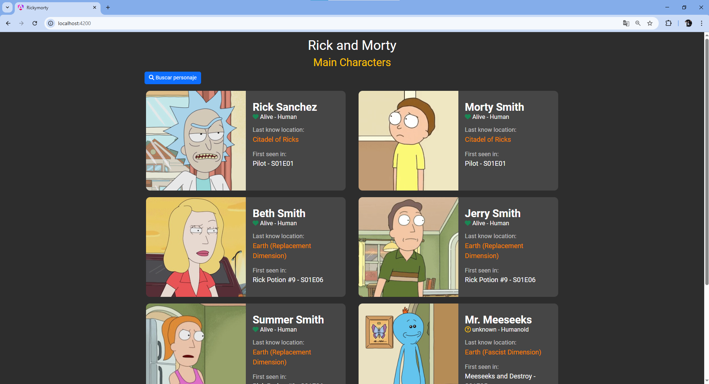
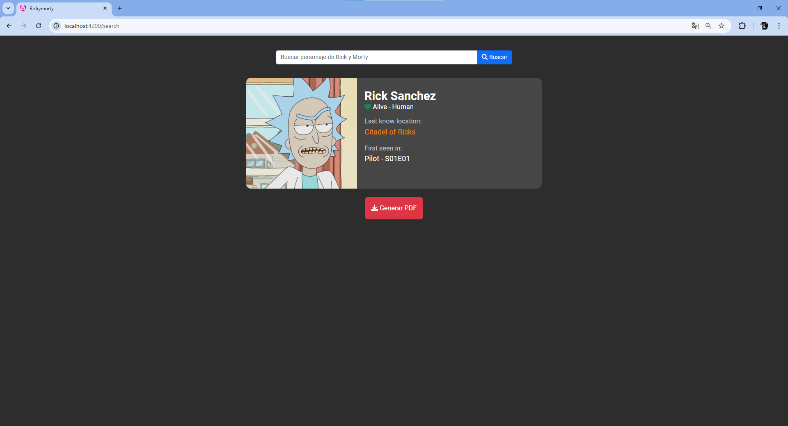
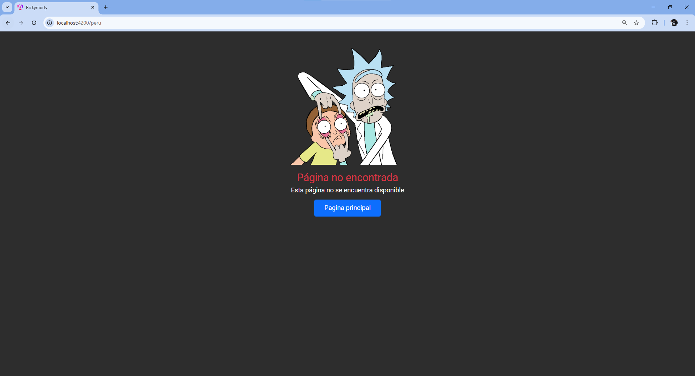

# RickandMorty Frontend 🔥
Este es un proyecto desarrollado en Angular que permite buscar personajes de la serie y mostrar su información, como nombre, estado, especie, ubicación y primer episodio donde aparecio el personaje.
## Instalar dependencias 🚀:
npm install
## Link de Backend 🚀:
https://github.com/LeoChaname21/Backend_RickandMorty
## Correr Proyecto 🚀:
npm start
## Ruta Base 🚀 : http://localhost:4200
Muestra los personajes principales de la serie Rick y Morty.

## Ruta BuscarPersonaje 🚀: http://localhost:4200/search

Permite una busqueda individual del personaje que deseas ver su información.

## Ruta Error ❌: 
Ejem: http://localhost:4200/peru

Muestra una página de error indicando al usuario que la página no existe.

